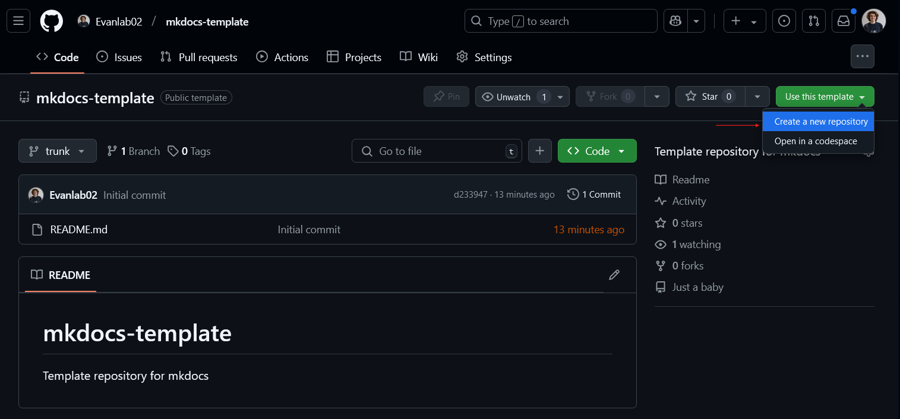

# mkdocs-template

Template repository for an mkdocs project.

## Pre-requisites

- Python 3.13 or higher
- uv 0.5.11 or higher
- make

## Using this template

### Method 1: Create repository via GitHub

If you would like to use this template repository as is. You can create a repository via GitHub using this repository as the template.



### Method 2: Monorepo

If you would like to integrate this into an already existing repository or a repository that will be a monorepo. You can use the following commands to do so.

**NOTE: You will require `git` and `npm` to be installed.**

```bash
npx degit git@github.com:Evanlab02/mkdocs-template.git <PATH_IN_YOUR_MONO_REPO>
cd <PATH_IN_YOUR_MONO_REPO>
make fresh
```

#### Method 2 - Post clone - Workflows

**You will need to update move and update the workflows to match the new structure.** 

- You can change `working-directory` in the workflows to match the path you cloned the repository into.
- You can change `cache-dependency-glob` in the workflows to be prefixed with the path you cloned the repository into.

## Post setup

You can do a text search over all the files in the template for the word `Template` or `template`. You can replace all these fields with something more suitable to your project.

You can also then proceed to rewrite this README for your project.
